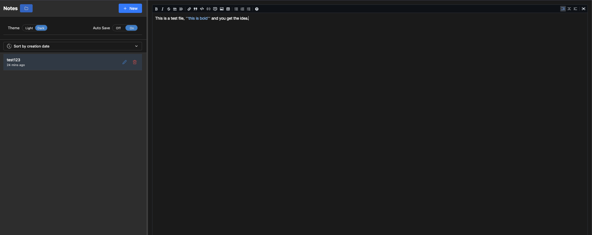
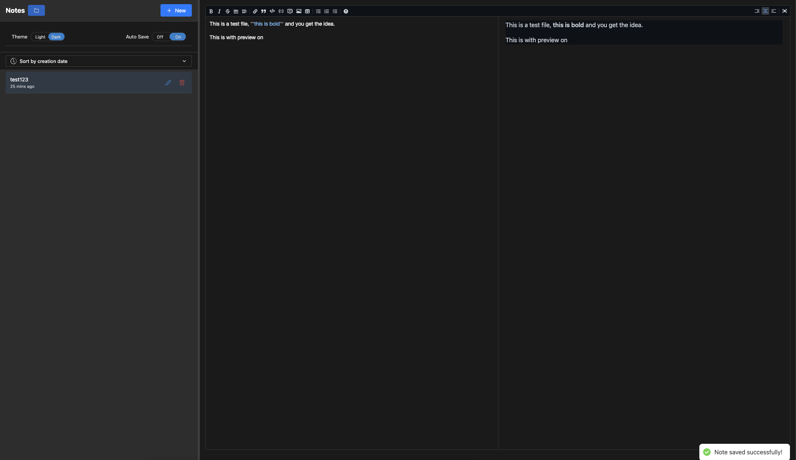
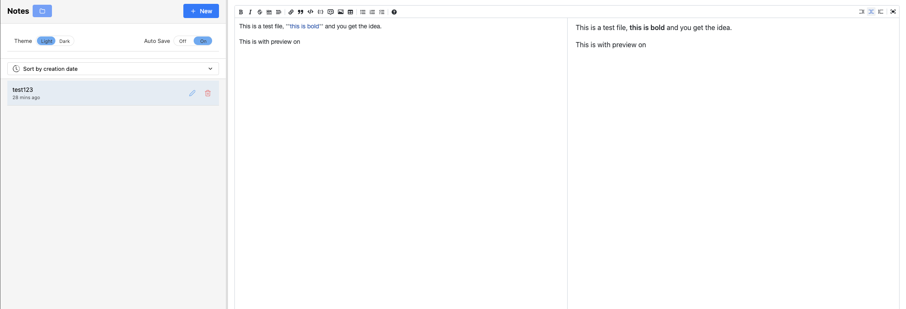

# Note Taking App

A simple note-taking application that creates and manages markdown files in your selected directory.

NOTE: This project is still in development and may not be fully functional and may have bugs.
```
THIS WAS CREATED BY AI, ALL I DID WAS TO GIVE INSTRUCTIONS AND SOLVE FEW ISSUES.
```
## Features

- Create and save notes in Markdown format
- Choose custom directory for note storage
- Real-time markdown preview
- Easy file management
- Customizable file naming

## Prerequisites

Before running this project, make sure you have:
- Node.js (v14.0.0 or higher)
- npm (v6.0.0 or higher)

## Installation

1. Clone the repository:
```

2. Navigate to the project directory:
```

3. Install dependencies:
```

## Running the Application

To start the development server:
```

The application will open in your default browser at `http://localhost:3000`

## Usage

1. Select a directory where you want to save your notes using the directory picker
2. Create a new note by clicking the "New Note" button
3. Write your content using Markdown syntax
4. Save your note using the save button
5. Your note will be saved as a .md file in the selected directory

## Screenshots
### Note Taking App in Dark Mode



### Note Taking App in Light Mode



## Project Structure

```
note-taking-app/
├── src/
│   ├── components/
│   │   ├── Toast.jsx
│   │   ├── Tooltip.jsx
│   │   └── ...
│   ├── App.jsx
│   └── main.jsx
├── public/
└── package.json
```

## Technologies Used

- React.js
- Node.js
- MDEditor

## Contributing

1. Fork the repository
2. Create your feature branch (`git checkout -b feature/AmazingFeature`)
3. Commit your changes (`git commit -m 'Add some AmazingFeature'`)
4. Push to the branch (`git push origin feature/AmazingFeature`)
5. Open a Pull Request

## License

This project is licensed under the MIT License - see the [LICENSE](LICENSE) file for details

## Contact

Your Name - [pratap.5dec@gmail.com]
Project Link: [https://github.com/AbhishekPratap05/note-taking-app]
